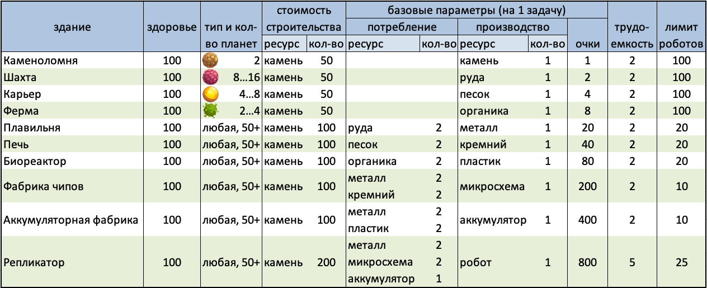

# SpbAIChamp'21. Описание игры

Действие игры, в которой будут соревноваться участники, происходит в космосе.

Цель игры — набрать как можно больше очков.

## Планеты

Игровой мир состоит из планет, случайно разбросанных на двумерной карте.
Гарантируется центральная симметричность карты, чтобы расположение и характеристики планет были одинаковыми для двух соревнующихся участников или команд.
**Координаты планет задаются целыми числами**.
Размер карты зависит от конфигурации игры — набора основных параметров, влияющих на уровень сложности.
На некоторых планетах возможна добыча ресурсов, причем **на одной планете может быть только один добываемый ресурс**.

## Ресурсы

Для полезных действий в игре необходимы ресурсы.
Ресурсы бывают как сырые, то есть **добываемые напрямую на некоторых планетах**, а так же получаемые в результате **переработки других ресурсов**.
В любом случае для получения ресурса необходимо здание, на котором работают роботы.

Ресурсы **не принадлежат конкретному игроку, а хранятся на планетах**.
Для того чтобы перенести ресурсы на другую планету для дальнейшей переработки, необходимы роботы.

## Роботы

На **случайно выбранной стартовой планете** участника размещаются роботы — основная рабочая сила в игре. Роботы могут:

- Выполнять работу в зданиях.

  **Работа выполняется автоматически** при условии доступности необходимых ресурсов.

- Перемещаться на другие планеты.

  Во время перемещения управление роботами невозможно.
  
  Подробнее в следующей секции.

- Брать с собой ресурсы при перемещении.

  Один робот может переносить одну единицу ресурса.

- Строить и чинить здания.

  Для начала строительства необходимо присутствие хотя бы одного робота.
  После начала строительства здания появляются с нулевым здоровьем, и их необходимо "починить" до полного здоровья.

  Один робот восстанавливает одну единицу здоровья здания за один тик.
  Здание может функционировать только при полном здоровье, поэтому **починка происходит автоматически**.

- Разрушать здания.

  Один робот убирает одну единицу здоровья здания за один тик.

- Сражаться с вражескими роботами.

  **Бой происходит автоматически**, если роботы противников находятся на одной планете.
  Один робот способен уничтожить одного вражеского робота за тик, то есть на планете всегда останутся роботы того игрока, у которого роботов больше.

  

  Оставшиеся на планете роботы также будут **автоматически уничтожать любых пролетающих вражеских роботов**.
  Подробнее - в секции про перемещение.

Каждый робот за один игровой тик может сделать **только одно из данных действий**.
Роботы всегда принадлежат конкретному игроку, и только он может отдавать им приказы.

## Перемещение

Время перемещения равно расстоянию между планетами.
Расстояние считается как сумма расстояний по двум координатам (**манхеттенское расстояние**).

Расстояние перемещения ограничено, однако гарантируется возможность добраться от любой планеты до любой другой.

При выполнении приказа перемещения, роботы взлетают с планеты, и дальнейшее управление этой группой невозможно до приземления на целевую планету.

Если до целевой планеты напрямую долететь невозможно, группа выбирает случайную планету, лежащую на одном из кратчайших путей до целевой.
При прибытии на промежуточную планету роботы аналогичным образом ищут следующую планету.
При этом на промежуточной планете роботы не приземляются.
В этот момент вражеские роботы, находящиеся на этой планете, могут атаковать их.

## Здания

На каждой планете можно построить здание, в котором роботы смогут выполнять работу.
Так же как и ресурсы, **здания не принадлежат игрокам**, вне зависимости о того, чьими роботами они были построены.
Таким образом любым построенным зданием может воспользоваться любой игрок (как союзник, так и соперник), для этого достаточно отправить туда своих роботов.

### Строительство

Для постройки зданий необходим определенный набор ресурсов, и роботы игрока на планете.
При получении приказа строительства, ресурсы сразу резервируются и здание появляется на планете с нулевым здоровьем.
Если ресурсов недостаточно, приказ игнорируется.

Для окончания строительства здание необходимо отремонтировать до полного здоровья.
Ремонт происходит автоматически при наличии роботов на планете.
Один робот восстанавливает одну единицу здоровья здания за тик.

Только при полном здоровье может выполняться работа в здании.

Если на планете уже присутствует здание, приказ строительства игнорируется.

### Разрушение

Разрушение зданий происходит аналогично строительству — каждый робот при наличии приказа убирает одну единицу здоровья за тик.
При достижении нулевого здоровья, здание пропадает из игрового мира.

### Работа

Работа в зданиях делится на задачи, которые выполняются последовательно.
Все задачи у одного здания одинаковые, и зависят от типа здания.

Для начала выполнения задачи может быть необходим набор ресурсов (если это здание не занимается добычей сырых ресурсов).
Таким образом, перед началом работы может быть необходимо сперва перевезти ресурсы с других планет.
Если на планете, где построено здание, не хватает ресурсов для начала задачи, работа останавливается.
Иначе ресурсы сразу же бронируются (удаляются из игрового мира), и задача считается начатой.

Для выполнения задачи необходимо выполнить определенное количество условных *единиц работы*.
Один робот может выполнить одну единицу работы за тик.

Как только задача выполнена, на планете со зданием появляется результат работы.
Это может быть либо ресурс, либо новый робот, в зависимости от типа зданий.
Репликатор (здание, производящее роботов) производит робота для того игрока, чей робот завершил задачу.
Также выполнение задачи может принести очки игроку, чей робот выполнил задачу (зависит от типа здания).

После того как задача выполнена, новая задача может начаться в тот же тик, то есть при наличии большого количества роботов в здании может выполниться больше одной задачи за тик.

## Объяснение процесса производства на примере

### Комментарии к иллюстрации выше

**Исходные данные**: на планете 12 ед. Металла, по 8 ед. Чипов и Аккумуляторов и 1 работник.

- На 1-м тике расходуются ресурсы под одну задачу (2М, 2Ч, 1А), и работник начинает ее выполнять.
- На каждом тике с 1 по 5 работник выполняет ровно 1 единицу работы.
- К концу 5-го тика задача выполнена полностью. Новый робот появится с началом следующего тика.
- В начале 6-го тика у нас уже 2 работника.
  После списания ресурсов на следующую задачу оба работника начинают параллельно ее выполнять.
  За этот тик они сделают 2 ед. работы.
- На 7-м тике работники выполнят еще 2 единицы работы.
- В середине 8-го тика задача будет выполнена.
  Новый (третий) робот останется "лежать на складе" до конца тика.
  А два старых робота - возьмутся за следующую задачу и успеют выполнить 1 ед. работы.
  Ресурсы на новую задачу спишутся сразу (в середине тика), но игрок увидит это только на следующем тике.
- На 9-м тике уже 3 работника продолжат выполнять начатую на прошлом тике задачу, добавив еще 3 ед. работы к прогрессу ее выполнения.
- На 10-м тике будут выполнены: 1 ед. работы от предыдущей задачи + 2 ед. работы от новой. Ресурсы снова спишутся в середине тика.
- К старту 11-го тика добавится 4-й робот, которого доделали на 10-м тике.
  А ближе к концу тика, когда уже будет сделан 5-й робот, выяснится, что для следующей задачи недостаточно ресурсов (кончились Чипы).
  В итоге четверть времени 11-го тика роботы (и вся фабрика вместе с ними) - будут простаивать без работы.
- На 12-м тике 5-й робот будет введен в эксплуатацию, но к работе не приступит, ожидая вместе с остальными доставку ресурсов.

## Конфигурация игры

Набор параметров игрового мира, задающих баланс игры, хранится в т.н. конфигурации.
В локальном приложении существуют несколько встроенных конфигураций: `Easy`, `Medium`, `Hard`, `Beta`.
Кроме того, конфигурацию можно настраивать самостоятельно при помощи внешнего `.json`-файла, который затем передается в качестве параметра локальному приложению.

На сервере всегда используется одна и та же конфигурация, соответствующая уровню сложности, привязанному к раунду чемпионата (чем ближе к Финалу – тем выше сложность).

Программа Участника во время игры получает параметры текущей конфигурации через поля объекта `Game`.
В частности, в ассоциативном массиве (словаре) `building_properties` хранятся настройки всех доступных в игре зданий.
Ниже эти значения приведены в табличном виде.

### Конфигурация "Beta" (ознакомительный раунд)

> **Примечание**: в таблице приведены параметры, актуальные на **30 сентября 2021г**.
> Организатор оставляет за собой право вносить любые изменения в баланс игры во время ознакомительного раунда.
> Следите за обновлениями.

## Управление игрой

Участники, посредством специального API, могут отправлять следующие приказы:

- Перемещение Роботов. Для этой команды задаются:

  - Планета, откуда необходимо отправить роботов
  - Планета, куда должны прибыть роботы
  - Количество роботов
  - Опционально, ресурс, который каждый из этих роботов возьмет с собой

  Если для выполнения приказа недостаточно роботов (игрок указал больше, чем есть фактически), будут отправлены все доступные на этой планете роботы.

  Если на планете не хватает ресурсов, указанных для перемещения, будут перемещены все доступные ресурсы, а оставшаяся часть роботов останется на планете.

- Строительство / разрушение зданий. Параметры этого приказа:

  - Планета, где нужно совершить действие
  - Тип здания, которое нужно построить. При отсутствии считается, что нужно разрушить существующее здание

  За один тик можно передать неограниченное количество приказов.

## Описание встроенной стратегии

Встроенная стратегия (**quickstart**) пытается играть только на своей половине планет, и полностью игнорирует вражеских роботов

1. Найти планеты, на которые требуются роботы - планеты, на которых есть здание и присутствует меньше 20 роботов
2. Для каждого ресурса найти список планет, где есть здание, которое производит данный ресурс
3. Для каждого ресурса найти список планет, где требуется этот ресурс для работы здания.
   Если здание производит ресурс, и на этой планете складировано хотя бы *3* данного ресурса, планета игнорируется.
   Если на планете присутствует хотя бы в *3* раза больше необходимого ресурса чем требуется для выполнения одной задачи, планета также игнорируется.
4. Если существует тип здания, которое нигде не построено, ищется первая планета где здание имеет смысл (для добывающих зданий на планете должен присутствовать соответствующий ресурс, для остальных подходит любая), и отправляется приказ на строительство данного типа здания на этой планете.
   Также для каждого ресурса, требуемого для строительства здания, планета добавляется в список из предыдущего шага.
5. Для каждого ресурса: добавить команды перемещения из каждой планеты, где ресурс производится (шаг 2), в каждую планету, где ресурс требуется (шаги 3 и 4).
   Каждая команда отправит группу из *1* робота, который возьмет с собой данный ресурс.
6. Из каждой планеты, где присутствуют роботы, в каждую планету, где роботы требуются (шаг 1), добавить команду перемещения *1* робота, который не будет брать с собой ресурс.
7. Из всего списка команд перемещения оставить только те, где на стартовой планете присутствуют хотя бы *10* роботов

## Ограничения

Время в игре дискретное и поделено на "тики".
В начале каждого тика, игровой симулятор передает состояние мира стратегиям участников, затем получает от них действия и обновляет состояние мира в соответствии с этими действиями и правилами игры.
Затем процесс повторяется для следующего тика с обновленным состоянием.
Длительность игры ограничена, но игра также может закончиться, если все стратегии "упали".

"Упавшая" стратегия больше не может управлять действиями своего игрока.
Стратегия считается "упавшей", если:

- Процесс стратегии непредвиденно завершился, или произошла ошибка в протоколе взаимодействия стратегии с игровым сервером.
- Стратегия превысила одно из ограничений по времени. Существует ограничение на время ответа (выбора действия) на каждый тик - 1 секунда реального времени, а также суммарное ограничение по времени на всю игру - 120 секунд реального времени.
## Описание API

В пакете для вашего языка программирования вы можете найти файл `MyStrategy.<ext>`/`my_strategy.<ext>`.
Этот файл содержит класс `MyStrategy` с методом `get_action`, где должна быть реализована логика вашей стратегии.

Этот метод будет вызываться каждый тик.

Метод принимает следующие аргументы:

- Доступная информация о текущем состоянии игры,
<!-- TODO - Отладочный интерфейс — этот объект позволяет отправлять отладочные команды и запрашивать отладочное состояние приложения прямо из кода вашей стратегии. Заметьте, что этот объект недоступен при тестировании на сервере, а также использовании приложения в консольном режиме (batch mode). Он предназначен только для локальной отладки. -->

Метод должен вернуть действие, которое вы хотите выполнить в данный тик.

<!-- TODO Для отладки существует еще один метод — `debug_update`, принимающий такие же параметры. Он вызывается постоянно во время работы приложения (но не в консольном режиме), если клиент находится в ожидании следующего тика. Метод будет вызван хотя бы раз между тиками. -->

## Описание объектов

В этой секции, некоторые поля могут быть опциональными (обозначается как `Option<type>`).
Способ реализации зависит от языка.
При возможности используется специальный опциональный (nullable) тип,
иначе другие методы могут быть использованы (например nullable указатели).

Некоторые объекты могут принимать несколько различных форм. Способ реализации зависит от языка.
Если возможно, используется специальный (алгебраический) тип данных,
иначе другие методы могут быть использованы (например варианты представлены классами, унаследованными от абстрактного базового класса).

## Model

### `Player`

Игрок (участник игры)

Поля:

* `score`: `int32` &mdash; Текущее количество набранных очков

### `Resource`

Тип ресурса

Варианты:

* `Stone` &mdash; Камень
* `Ore` &mdash; Руда
* `Sand` &mdash; Песок
* `Organics` &mdash; Органика
* `Metal` &mdash; Металл
* `Silicon` &mdash; Кремний
* `Plastic` &mdash; Пластик
* `Chip` &mdash; Микросхема
* `Accumulator` &mdash; Аккумулятор

### `WorkerGroup`

Группа роботов на планете

Поля:

* `player_index`: `int32` &mdash; Индекс игрока, которому принадлежат роботы
* `number`: `int32` &mdash; Количество роботов в группе

### `BuildingType`

Тип здания

Варианты:

* `Quarry` &mdash; Каменоломня, добывает камень
* `Mines` &mdash; Шахта, добывает руду
* `Career` &mdash; Карьер, добывает песок
* `Farm` &mdash; Ферма, добывает органику
* `Foundry` &mdash; Плавильня, производит металл
* `Furnace` &mdash; Печь, производит кремний
* `Bioreactor` &mdash; Биореактор, производит пластик
* `ChipFactory` &mdash; Фабрика микросхем, производит микросхемы
* `AccumulatorFactory` &mdash; Аккумуляторный завод, производит аккумуляторы
* `Replicator` &mdash; Репликатор, производит новых роботов

### `Building`

Здание

Поля:

* `building_type`: `BuildingType` &mdash; Тип здания
* `health`: `int32` &mdash; Текущее здоровье
* `work_done`: `int32` &mdash; Количество проделанной работы в рамках текущей задачи

### `Planet`

Планета

Поля:

* `id`: `int32` &mdash; Уникальный идентификатор планеты
* `x`: `int32` &mdash; Координата x
* `y`: `int32` &mdash; Координата y
* `harvestable_resource`: `Option<Resource>` &mdash; Ресурс, добываемый на планете
* `worker_groups`: `[WorkerGroup]` &mdash; Список групп роботов
* `resources`: `Map<Resource -> int32>` &mdash; Ресурсы, складированные на планете
* `building`: `Option<Building>` &mdash; Здание, построенное на планете

### `FlyingWorkerGroup`

Группа летящих роботов

Поля:

* `player_index`: `int32` &mdash; Индекс игрока, которому принадлежат роботы
* `number`: `int32` &mdash; Количество роботов в группе
* `departure_tick`: `int32` &mdash; Тик начала полета с предыдущей планеты в пути
* `departure_planet`: `int32` &mdash; Идентификатор предыдущей планеты в пути
* `next_planet_arrival_tick`: `int32` &mdash; Тик прибытия на следующую планету в пути
* `next_planet`: `int32` &mdash; Идентификатор следующей планеты в пути
* `target_planet`: `int32` &mdash; Идентификатор конечной планеты
* `resource`: `Option<Resource>` &mdash; Ресурс, который роботы везут с собой

### `BuildingProperties`

Свойства строения

Поля:

* `build_resources`: `Map<Resource -> int32>` &mdash; Ресурсы, необходимые для постройки этого здания
* `max_health`: `int32` &mdash; Максимальное количество здоровья здания
* `max_workers`: `int32` &mdash; Максимальное количество работников в здании
* `work_resources`: `Map<Resource -> int32>` &mdash; Ресурсы, необходимые для начала выполнения новой задачи
* `produce_worker`: `boolean` &mdash; Появляются ли в результате выполнения задач новые роботы
* `produce_resource`: `Option<Resource>` &mdash; Ресурс, появляющийся в результате выполнения задач
* `produce_amount`: `int32` &mdash; Количество ресурса/роботов, появляющихся в результате выполнения одной задачи
* `produce_score`: `int32` &mdash; Количество очков, дающихся за выполнение одной задачи
* `harvest`: `boolean` &mdash; Является ли здание добывающим. В таком случае ресурс производится только в случае если его можно добывать на планете
* `work_amount`: `int32` &mdash; Количество работы необходимое для выполнения одной задачи

### `Game`

Текущее состояние игры

Поля:

* `my_index`: `int32` &mdash; Индекс вашего игрока
* `current_tick`: `int32` &mdash; Номер текущего тика
* `max_tick_count`: `int32` &mdash; Максимальное количество тиков в игре
* `players`: `[Player]` &mdash; Список игроков
* `planets`: `[Planet]` &mdash; Список планет
* `flying_worker_groups`: `[FlyingWorkerGroup]` &mdash; Список летящих групп роботов
* `max_flying_worker_groups`: `int32` &mdash; Максимальное количество летящих групп роботов одного игрока
* `max_travel_distance`: `int32` &mdash; Максимальное расстояние прямого перелета между планетами
* `max_builders`: `int32` &mdash; Максимальное количество роботов занимающимися постройкой на одной планете
* `building_properties`: `Map<BuildingType -> BuildingProperties>` &mdash; Свойства каждого из вариантов зданий

### `DebugData`

В данный момент не используется

Поля:

### `MoveAction`

Приказ перемещения

Поля:

* `start_planet`: `int32` &mdash; Идентификатор планеты, с которой нужно отправить роботов
* `target_planet`: `int32` &mdash; Идентификатор целевой планеты
* `worker_number`: `int32` &mdash; Количество роботов, которых нужно отправить
* `take_resource`: `Option<Resource>` &mdash; Ресурс, который нужно взять с собой

### `BuildingAction`

Приказ строительства

Поля:

* `planet`: `int32` &mdash; Идентификатор планеты, где нужно выполнить приказ
* `building_type`: `Option<BuildingType>` &mdash; Тип здания, который нужно построить. Если отсутствует, будет сноситься текущее построенное здание

### `Action`

Действия игрока

Поля:

* `moves`: `[MoveAction]` &mdash; Список приказов перемещения
* `buildings`: `[BuildingAction]` &mdash; Список приказов строительства
